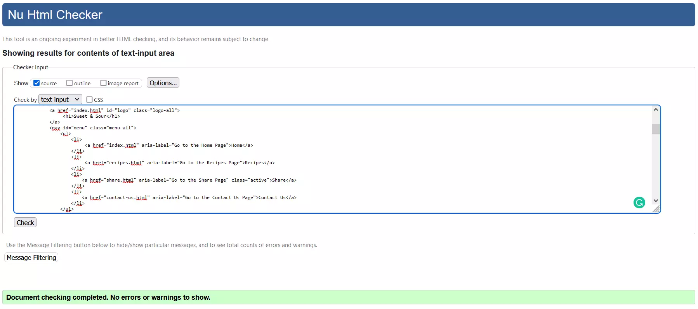

# **Sweet & Sour** Website

### **Developer: Claudio Crocilla**

## **Overview**

#### The website provides the possibility to discover new recipes and not just that! 
#### Internet users all around the world love to share every day experience using Social Media. Sharing images, documents, stories are part of everyday life. With this website the user will have the possibility to share one of the most beautiful thing in life… The passion for Food! Thousands of recipes will be available, each, for user convenience, categorized into 3 main sessions (Appetizer, Main, and Dessert). The best recipes are rewarded by making the Home Page in the section “Recipe of the Day!”
#### The website is intuitive and user-friendly, guiding the users and helping them choosing the dishes that they’d like to prepare, showing a step by step guide to prepare the most delicious food, a detailed list of the needed ingredients, the level of difficulty, including images of the finished product. In addition, checkboxes are provided for the ingredient list giving the user the possibility to easily discover what is present/missing for the realization of the dish! The users can subscribe to a newsletter to receive regular updates and are also provided the possibilities to share their own personal recipes with the entire community.

Click in the image above to access the Live Website or [click here!](https://ccrocilla.github.io/sweet_and_sour/ "Sweet & Sour's Home Page")

## **Project** 

### **User Goal**
- Easy, Intuitive and User-Friendly Website!
- Wide compatibility with every Browsers and Devices.
- Images of the final products are displayed to catch users attention (and appetite!), providing clear instructions for the realization of the dishes and a detailed lists of needed ingredients.
-  Possibility of checking dedicated checkboxes, in order to highlight what is missing/presents for the realization of the selected dishes and help your supermarket trips!
- Possibility for the user to share his/her own recipes.
- Newsletter available to receive daily, weekly or monthly recipes via email.

---

## **User Experience (UX)**

### **User Stories**
- #### First Time Visitor Goals
	1. As a First Time visitor of a website dedicated to food and recipes, I need to be able to have a visual impact of the type of food and recipes sponsored by 		this websites, this can be obtained showing images of the finished food products.  
	2. As a First Time Visitor, I want to be able to navigate through the website and find recipes easily.
	3. As a First Time Visitor, I want to be able to access a large variety of recipes.
	4. As a First Time Visitor, I want to see in the foreground the necessary ingredients for the realization of the dishes. 
	5. A First Time Visitor, I want to visually see the recipes and to understand their level of complexity.
	6. As a First Time Visitor, I want to find the website pleasant to the eye, visually intuitive, with catchy colours and images.

- #### Returning Visitor Goals
	1. As a Returning Visitor, I want to frequently be able to find new recipes.
	2. As a Returning Visitor, I want to share my personal recipes with the rest of the community sharing a similar passion for cooking.
	3. As a Returning Visitor, I want to access the website through my social media accounts.

- #### Frequent User Goals
	1. As a Frequent User, I want to see the Recipe of the Day.
	2. As a Frequent User, I want to check if the recipe that I sent is displayed in the Home Page.
	3. As a Frequent User, I want to sign up to the Newsletter in order to receive daily/weekly/monthly updates on the recipes and news. 

<!-- Use Cases Area -->
### **Use Cases**

### *__Home Page__*

    
Description

    
- User can use this website to discover and share new recipes, in the home page the best recipes are selected and visualized in the Recipe of the Day section. 
- Users should be able to see the most important information required for the realization of the dish, the ingredients and the preparation.
- The home page also provides information about the history and rational of the website.

    
System & Actors

**System:** Website with recipes.

**Actors:** User looking for some delicious food, new ideas to bring to their table and to share with the community.

    
Pre-Conditions

No Pre-Conditions Required.

    
Basic Flow

- The user browses recipes food and discover the website. The user navigates to the Home Page of the website, and it is captured by the Recipe of the Day. 
- The user see if the ingredient are present in his/her inventory and have the possibility to flag the missing ones using the checkboxes (The user can also take a screenshot of the ingredient list). 
- The user can see the list of steps necessary for the preparation of the dish clicking on the Read More button. 

    
Alternative/Exception Flow

- When the user selects a non-existent page, a 404 Error Page will be prompted guiding the user back to Home Page.

### *__Recipes Page__*

    
Description

- Users can use this website to discover new recipes. 
- Users are able to browse between different type of dishes (Appetizers, Main Courses, or Desserts).
- In this case the website should provide a clear section dedicated to the visualization of the dish as well as the ingredient necessary and a step by step guides for the preparation and realization. 

    
System & Actors

**System:** Website with recipes.

**Actors:** Users looking for some new recipes and delicious food.

    
Pre-Conditions

No Pre-Conditions Required.

    
Basic Flow

- The user browses recipes and discover the website. The user navigate to the home page and then go in the Recipes Page. 
- The users select one of the available categories and will be prompted into the desired section.
- The user can see the image of the dish, the necessary ingredients, and the level of difficulty and have the possibility to flag the ingredients present/missing to complete the dishes, using checkboxes (The users can also take a screenshot of the ingredient list). 
- The user can see the list of steps necessary for the preparation by clicking on the Read More Button and will be prompted in a new page where they can see the image of the final product, the ingredients and the preparation steps.  

    
Alternative/Exception Flow

When the user selects a non-existent page, a 404 Error Page will be prompted guiding the user back to Home Page.

### *__Share__*

    
Description

- Users can use this website to share their own recipes, having the possibility to “make the Home Page” by being selected for The Recipe of the Day section. 
- Users should be able to fill-in an easy form to share their recipes providing basic personal information and the description and list of ingredients for the realization of the dish. 
- The users can reset the form if needed or, when the steps are completed, submit their recipes, including the possibility of attaching an image of their final product.

    
System & Actors

**System:** Website with recipes.

**Actors:** Users that would like to share their own recipes.

    
Pre-Conditions

No Pre-Conditions Required.

    
Basic Flow

- The user navigates to the section of the website where it is possible to share his/her own recipe. 
- The user fill in the form (Name, email, name of the Recipe, Ingredient and Preparation steps) following the instruction provided in the placeholder for each textbox.
- The user can upload images.
- The user can clear the form using the Reset Form button.
- The user can submit the form using the Submit button.
- Once the user has submitted the form a new page will be prompted Thanking the user for submitting the form.

    
Alternative/Exception Flow

When the user does not fill-in the form correctly, an error message will be triggered in relation to the field that has not being filled in. 

---

## **Design**

#### The webpage has been designed to provide a simple, intuitive view which is able to offer a quick overview of the necessary information needed by the user to prepare the selected recipes including images of the finished preparation and the needed ingredients and cooking times for a perfect result. 
#### Every page has a minimalistic structure which however contains all the relevant features in order to provide the user with a simple, clear and effective experience.  

- ### **Colour Scheme**
#### The goal is to use a colour palette that will provide the user with a good and positive impact at a first glance, when opening the website and through the entire navigation experience. 
#### The list of colors is chosen to be pleasing to the eyes providing an excellent contrast that will allow the user to have prolonged navigation hours without tiring the eyes. 
Colour Source: 
  - #### [Adobe Color](https://color.adobe.com/create/color-wheel)
  - #### [Color Hunt](https://colorhunt.co/) 
#### The main colors are Navy (#181D31) and Beige (#E6DDC4) and those characterize the full website while Orange (#FB743E) is used to make a good contrast in the elements to provide a better view of those elements. 
 

- ### **Typography**
#### Google Fonts has been used to select the fonts for the Website. 
#### The Main fonts used are: 'Oxigen' and 'Viga' while the Sans-serif has been set up as fall-back in case the main font is not loaded. 
Source:
  - [Google Fonts](https://fonts.google.com/)

- ### **Images and Videos**
#### Real images have been used to show the completed recipes.
#### The developer selected a video for the home page of the websites, the selected video helps in providing a pleasant visual experience to the user.
Sources:  
  - [Pexels](https://www.pexels.com/)

--- 

## **Features**
- ### Structure:
The page has been structured in an easy and user-friendly way with 6 different pages. 
The Structure of the website and the components used are listed below: 

- ### Home Page:
The Home Page shows the logo of the website on the top left of the page and a navigation bar on the top right.
A small underline animation activates when the user mouse hovers on of the elements in the nav bar, highlighting the content. 
The active page is underlined in the navigation bar when selected. 
Depending on the device used (if laptop, desktop, tablet or smartphone) the positions of the logo and the nav bar change, with the latest moving below the logo to adapt the view for a highly responsive rendering, centering the elements. 
Those behaviour are consistent in all pages. 
Following from Logo and the nav bar the user will see a Hero Image below which there is a section to introduce the website and its rational to the user and an additional section dedicated to the Recipe of the Day.
The Recipe of the Day shows an image of the recipe and the necessary ingredient for the realization of the dish using an unordered list.
In the unordered list, checkboxes for each ingredient are introduced in order to allow the user to flag what might be missing and have the possibility to take a screenshot of the list of the necessary ingredients.

- ### Recipes Page:
This page has Header and Footer consistent with the Home Page. 
The Recipes page is divided in sections: Appetiser, Main and Dessert.
On the top of the page, there is a Hero Image below the Logo and the Nav Bar. Below that 3 different buttons allow the user to easily reach the different sections of the page. 
In each section there are 3 dishes displayed with an image and the ingredients. All the recipes have a clickable "Read More" button that opens a Popup.
The Popup displays the Details of the dish and the steps necessary for the realization. 
When changing device, the visualization of the elements displayed will change adapting to the selected device dimensions. 

- ### Share Page:
This page has Header and Footer consistent with the Home Page.
The page has an image extended as background on top of which there is a form that the user can fill to be able to send and share a recipe including an attachment button for images. 
All the fields have been set as required (at exception of the textarea elements for Ingredient and Preparation) and a proper message is displayed to the user if the form is not filled correctly. 
A Reset and a Submit Button are included.
The Reset Button resets the form. 
The Submit Button opens a dummy thank you page to provide a clear feedback to the user stating that the recipe has been sent. 

- ### Contact Us Page:
This page has Header and Footer consistent with the Home Page.
The page is characterized by an image extended as background on top of which there is a form that the user can fill with the following information: First Name, Last Name, Email Address and a Radio Button to select the frequency by which the users can receive the newsletter (daily, weekly, monthly).
A Reset and a Sign In Button are included.
The Reset Button resets the form. 
The Sign In Button opens a dummy thank you page to provide a clear feedback to the user stating that the form has been sent correctly.  

- ### Thank you page:
This page will be triggered when the user clicks on the Submit Button for both the Share and Contact Us Page. 
The page is characterized by an image extended as background overlaid by a clear message for the user.
This page is used to let the user know that the data has been inserted correctly.
The users have also the possibility to click on the highlighted orange text in order to navigate back to the Home Page. 

- ### 404 Error Page:
For any broken or incorrect links, the 404 Error page will be triggered. Here the user will have an image displayed in the background and above text box that will inform the users that the page is not correct. 
A hyperlink is present in the text displayed and highlighted in orange in order to allow the user to navigate back to the Home Page.  
 
---

## **Wireframe**
#### Balsamiq has been used in order to create the wireframe.
#### Below you can open the accordions divided by page and by device used (desktop, tablet and smartphone).

- ## Home Page 

    
Click here for Desktop View
  

    
Click here for Tablet View

    
Click here for Smartphone View

- ## Recipes Page

    
Click here for Desktop View

    
Click here for Tablet View

    
Click here for Smartphone View

- ## Share Page

    
Click here for Desktop View

    
Click here for Tablet View

    
Click here for Smartphone View

- ## Contact Us Page

    
Click here for Desktop View

    
Click here for Tablet View

    
Click here for Smartphone View

- ## Thanks You Page

    
Click here for Desktop View

    
Click here for Tablet View

    
Click here for Smartphone View

- ## 404 Error Page

    
Click here for Desktop View

    
Click here for Tablet View

    
Click here for Smartphone View

---

## **Technologies Used**

- ### **Languages**

#### The Languages used are:
 - HTML5
 - CSS3

#### Only custom HTML and CSS Code has been used.

- ### **Frameworks, Libraries & Programs Used** 

#### No Design Framework has been used.

- #### Google Fonts: 
    - #### Google fonts were used to import the font into the style.css file which is used on all pages throughout the project.

- #### Font Awesome:
    - #### Font Awesome was used on all pages throughout the website to add icons for aesthetic and UX purposes.

- #### Git: 
    - #### Git was used for version control by utilizing the Gitpod terminal to commit to Git and Push to GitHub.

- #### GitHub: 
    - #### GitHub is used to store the projects code after being pushed from Git.

- #### Balsamiq: 
    - #### Balsamiq was used to create the wireframes during the design process.

- #### TinyPNG
    - #### TinyPNG has been used to compress images.

---
## **Testing**
The testing phases have been carried out using the **W3C CSS Validator** and **W3C Markup Validator** in all pages. No errors have been identified from the Validators as can be seen in the screenshot below: 

- **CSS**

    
Click here for W3C CSS Validator

    
Click here for W3C CSS Validator - Warning

- **HTML**

    
Click here for W3C Markup Validator - Home Page

    
Click here for W3C Markup Validator - Recipes

    
Click here for W3C Markup Validator - Share

    
Click here for W3C Markup Validator - Contact Us

    
Click here for W3C Markup Validator - Thank You

    
Click here for W3C Markup Validator - Error 404

- ### **Lighthouse Validator**
Below it is possible to taka e look at the result obtained in Lighthouse:

    
Click Here for Lighthouse Desktop - Homepage

    
Click Here for Lighthouse Mobile - Homepage

    
Click Here for Lighthouse Desktop - Recipes

    
Click Here for Lighthouse Mobile - Recipes

    
Click Here for Lighthouse Desktop - Share

    
Click Here for Lighthouse Mobile - Share

    
Click Here for Lighthouse Desktop - Contact Us

    
Click Here for Lighthouse Mobile - Contact Us

    
Click Here for Lighthouse Desktop - Thanks you

    
Click Here for Lighthouse Mobile - Thanks you

    
Click Here for Lighthouse Desktop - Error 404

    
Click Here for Lighthouse Mobile - Error 404

- ### **Test Cases**

List of Test Cases perfomed. All the Tests have also been performed in all the Devices and the tests includes also Layout testing. 

| Page | Feature | Expected Result | Status | 
| --- | --- | --- | --- |
| Home | Header | Make sure that the Logo and the nav bar are displayed on the top part of the Home Page. | Pass |
| Home | Header | Make sure that by clicking on the Logo the user is redirected to the Home Page. | Pass |
| Home | Header | Make sure that the Hero Image is displayed below the Logo and Nav Bar with no overlap with other contents. | Pass |
| Home | Video Story Section | Make sure that the video apppears in the Story Section and that the autoplay works. | Pass |
| Home | Video | Make sure that the user is able to stop the video. | Pass |
| Home | Video | Make sure that video is muted when the homepage is opened. | Pass |
| Home | Recipe of the Day | Make sure that the section is aligned and Image, Details, Ingredients and the Read More Button are correctly displayed. | Pass |
| Home | Recipe of the Day | Make sure that, when clicking on the Read More Button a Popup is opened displaying the Preparation steps. | Pass |
| Recipes | Nav bar Section | Make sure that, when clicking on Appetizers, Main and Desserts Button the user is redirected to the chosen section. | Pass |
| Recipes | Appetizers, Main, Desserts Sections | Make sure that the content/items are correctly displayed and aligned to the center. | Pass |
| Recipes | Appetizers, Main, Desserts Sections | Make sure that in each recipe card the Read More Button works and opens the Popup with Details and Steps. | Pass |
| Recipes | Appetizers, Main, Desserts Sections | Make sure that the slider button in each section works and that the user is able to reach the correct recipe. | Pass |
| Share | Images | Make sure that the background image is displayed correcly. | Pass |
| Share | Form | Make sure all the fields (First Name, Email, Recipe Name, Ingredients and Preparation) are editable. | Pass |
| Share | Form | Make sure all the fields (First Name, Email, Recipe Name) are mandatory. Make sure that that the user will receive a clear message when these mandatory fields are not filled after clicking on the Submit Button. | Pass |
| Share | Form | Make sure that the Reset Form Button works and that deletes all the information entered in the form. | Pass |
| Share | Form | Make sure that the Submit Button works and that opens the thank you page. | Pass |
| Contact Us | Images | Make sure that the background image is displayed correcly. | Pass |
| Contact Us | Form | Make sure all the fields (First Name, Last Name and Email) are editable. | Pass |
| Contact Us | Form | Make sure that the Reset Form Button works and that deletes all the information entered in the form. | Pass |
| Contact Us | Form | Make sure that the Sign In Button works and that opens the thank you page. | Pass |
| 404 Error Page | Image | Make sure that the background image is displayed correctly when the user is automatically redirected to the 404 Error Page if trying to displaying a page that does not exist in the website. | Pass |
| 404 Error Page | Text | Make sure that the text is displayed in the center of the page. | Pass |
| 404 Error Page | Text | Make sure that the user can be redirected back to the Home Page using the Home anchor element present in the text. | Pass |
| Thank you Page | Image | Make sure that the page opens when the user clicks on the Submit Button in Share | Pass |
| Thank you Page | Image | Make sure that the page opens when the user clicks on the Sign In Button in the Contact Us Page | Pass |
| Thank you Page | Image | Make sure that the background image is displayed. | Pass |
| Thank you Page | Text | Make sure that the text is displayed in the center of the page. | Pass |
| Thank you Page | Text | Make sure that the user can be redirected back to the Home Page using the Home anchor element present in the text. | Pass |

### **Additional Tests**
Tests have been performed on Firefox, Microsoft Edge, Chrome and Safari and the result is consistent in all the browsers. 

Additional tests include checks on different devices using the Toggle Device Emulation in Firefox and Microsoft Edge. Below the list of devices used for the tests through the Responsive Design Mode in Firefox is shown:
* iPhone 12 Pro Max
* iPad Pro
* iPad 
* Moto 4G
* Samsung Galaxy S20 Ultra
* Surface Duo

### **Bugs**
- Double Scroll y-axis bars in Read More Popup
#### Please note that when opening the Read More Popup, two scroll bars y-axis are visible.
#### Pleasde note that only one should be visible. 
#### The developer is aware of this issue, with a fix under investigation for future releases. 

- No other bugs could be found in the website during the test phase.

---

## **Development** 
### Deployment

- ### **Github**
The repository for the project Sweet & Sour has been created using Github using the following procedures:
1. Create a Github account [Github.com](https://github.com/)
2. In the top left Github Home Page click on the green New Button in order to create a new repository
3. Select the Template if available (Example: Code-Institute-Org/gitpod-full-template)
4. Choose the Repository name
5. Click on the Create Repository Button in order to create the repository
6. Install the Gitpod Extension in your browser
7. Once Gitpod Extension has been installed, accessing the repository previously created, click on the Gitpod Button
8. A new page will be opened and the Workspace will be created
   

- ### **GitHub Pages**
The project was deployed to GitHub Pages using the following steps:
1.	Log in to GitHub and locate the GitHub Repository created
2.	Click on the Setting Button
3.	On the left menu bar, click on the "Pages" Tab
4.	Under "Source", click the dropdown called "None" and select "Main"
5.	The page will automatically refresh
6.	When the website is disployed, on top of this page you can see the link of the live website 

<!-- Forking Content from Code Institute Readme File Sample -->
- ### **Forking the GitHub Repository**  
By forking the GitHub Repository we make a copy of the original repository on our GitHub account to view and/or make changes without affecting the original repository by using the following steps:
1.	Log in to GitHub and locate the GitHub Repository
2.	At the top of the Repository (not top of page) just above the "Settings" Button on the menu, locate the "Fork" Button
3.	You should now have a copy of the original repository in your GitHub account

- ### **Local Clone**
By creating a Local Clone you will be able to create a copy of the repository that is avilable in your local computer.
In order to create a Local Clone follow the steps below: 
1.	Log in to GitHub and locate the GitHub Repository that you want to clone
2.	Click on the Code Button
3.	To clone the repository using HTTPS, under "Clone with HTTPS", copy the link
4.	Open Git Bash
5.	Change the current working directory to the location where you want the cloned directory to be made
6.	Type git clone as shown in the example below and then paste the URL copied in Step 3
>$ git clone https://github.com/YOUR-USERNAME/YOUR-REPOSITORY
1. Press Enter 
2. Your local clone will be created

---
## **Credits**

Thanks to my Mentor, Narender Singh, for his guide and support in the realization of this project.
Thanks to the useful reference and suggestions derived from sources listed below, I manage to gain a deeper understanding of how the various elements/components of HTML and CSS are used. In addition, continuous trial and error tests provided a useful means to further experiment on the usage of these two programming languages for the creation of the site.

- ### Content & Media
All of the contents on the website are customised and no design frameworks have been used for the realization of the site.
The idea of the Logo, the Navbar and the Footer were taken from the Love Running Project analysing and customizing their implementation for the created website.
I explored the writing part of the code and the best practices associated to this using the two sites listed below. Consulting those allowed me to further cement the learning gained during the Code Institute Course.
- [Medium.com](https://medium.com/@inceptiondj.info/html-css-coding-best-practice-fadb9870a00f)
- [Learn.shayhowe.com](https://learn.shayhowe.com/html-css/writing-your-best-code/)

After deciding to create a website for people who love food in one of the cooking sites I was often referring to (giallozafferano.com), opening the browser console, I came across the sign flex and tried to understand what it was. This led me to explore around several other websites including some tutorials on YouTube. 
This gave me the inspiration of implementing the use of flex boxes which was very important for the creation of the site. 
Listed here the Source of the studies: 
- [Flexbox - W3School.com](https://www.w3schools.com/css/css3_flexbox.asp)
- [Css-tricks.com](https://css-tricks.com/snippets/css/a-guide-to-flexbox/)
- [Developer.mozilla.org](https://developer.mozilla.org/en-US/docs/Web/CSS/CSS_Flexible_Box_Layout/Basic_Concepts_of_Flexbox)
- [Flex properties - W3School.com](https://www.w3schools.com/cssref/css3_pr_flex.asp)
- [Web Dev Simplified - Youtube Video](https://www.youtube.com/watch?v=fYq5PXgSsbE)

One of the most complex pages for the implementation of the website was the Recipes Page. My mentor Narender Singh (Mentor) provided some materials where I could observe and study the implementation of sliders using only css with no JavaScript, generally used for these types of tasks. 

The following websites were inspirational for customizing the code of the slider to my needs:
- [Thanks to Chris Coyier for the Slider](https://codepen.io/chriscoyier/pen/XwbNwX)

- [Thanks to Anna Blok for the Popup](https://codepen.io/anna_blok/pen/KKpwRVe)

- [Favicon.io](https://favicon.io/) was used to include the favicon in the website.
- [Cooks.com](https://www.cooks.com/) was used as reference for the creation of the recipes. 

For the realization of the 404 error page I found a guide on how to create the file here: 
- [Docs Github](https://docs.github.com/en/pages/getting-started-with-github-pages/creating-a-custom-404-page-for-your-github-pages-site)

Thanks to Kasia Bogucka and Narender Singh for suggesting the use of github wiki site to create the Markdown file. They have also provided the link for the Sample Readme of Code Institute.
- [Sample Readme File - Code Institute](https://github.com/Code-Institute-Solutions/SampleREADME)
- [Markdown - Cheatsheet](https://github.com/adam-p/markdown-here/wiki/Markdown-Cheatsheet)

All the Images as well as the Video included in the Home Page have been taken from [Pexels.com](https://www.pexels.com/)

Thank you to the entire Code Institute Team and the Slack Community for their feedback, help and support. 